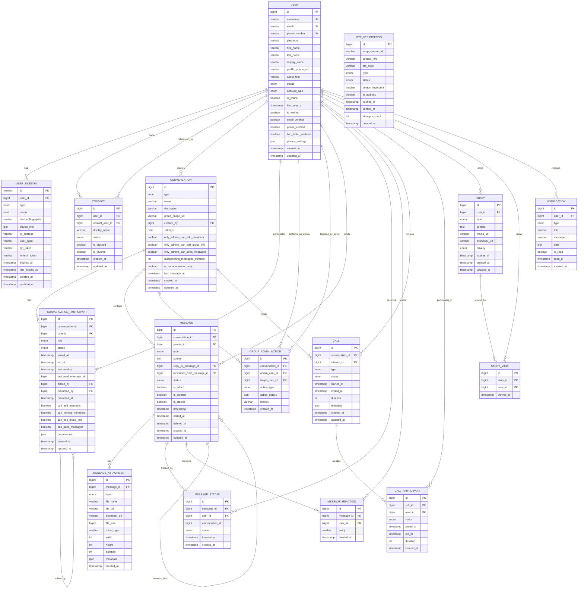

# WhatsApp System ER Diagram

## Entity Relationship Diagram



## Database Schema Details

### Primary Keys
- **Auto-increment IDs**: Most entities use `BIGINT AUTO_INCREMENT` for scalability
- **UUID-based IDs**: UserSession uses string-based UUID for security
- **Composite Keys**: Some junction tables could use composite keys for better performance

### Foreign Key Relationships

#### User-Centric Relationships
- `USER_SESSION.user_id` → `USER.id`
- `CONTACT.user_id` → `USER.id`
- `CONTACT.contact_user_id` → `USER.id`
- `CONVERSATION.created_by` → `USER.id`
- `CONVERSATION_PARTICIPANT.user_id` → `USER.id`
- `CONVERSATION_PARTICIPANT.added_by` → `USER.id`
- `CONVERSATION_PARTICIPANT.promoted_by` → `USER.id`
- `GROUP_ADMIN_ACTION.admin_user_id` → `USER.id`
- `GROUP_ADMIN_ACTION.target_user_id` → `USER.id`
- `MESSAGE.sender_id` → `USER.id`
- `MESSAGE_STATUS.user_id` → `USER.id`
- `MESSAGE_REACTION.user_id` → `USER.id`
- `CALL.initiator_id` → `USER.id`
- `CALL_PARTICIPANT.user_id` → `USER.id`
- `STORY.user_id` → `USER.id`
- `STORY_VIEW.user_id` → `USER.id`
- `NOTIFICATION.user_id` → `USER.id`

#### Conversation-Centric Relationships
- `CONVERSATION_PARTICIPANT.conversation_id` → `CONVERSATION.id`
- `GROUP_ADMIN_ACTION.conversation_id` → `CONVERSATION.id`
- `MESSAGE.conversation_id` → `CONVERSATION.id`
- `CALL.conversation_id` → `CONVERSATION.id`

#### Message-Centric Relationships
- `MESSAGE_ATTACHMENT.message_id` → `MESSAGE.id`
- `MESSAGE_STATUS.message_id` → `MESSAGE.id`
- `MESSAGE_REACTION.message_id` → `MESSAGE.id`
- `MESSAGE.reply_to_message_id` → `MESSAGE.id`
- `MESSAGE.forwarded_from_message_id` → `MESSAGE.id`

#### Call-Centric Relationships
- `CALL_PARTICIPANT.call_id` → `CALL.id`

#### Story-Centric Relationships
- `STORY_VIEW.story_id` → `STORY.id`

### Indexes for Performance

#### User Table Indexes
```sql
CREATE INDEX idx_user_email ON users(email);
CREATE INDEX idx_user_phone ON users(phone_number);
CREATE INDEX idx_user_username ON users(username);
CREATE INDEX idx_user_status ON users(status);
CREATE INDEX idx_user_online ON users(is_online);
```

#### Session Table Indexes
```sql
CREATE INDEX idx_session_user ON user_sessions(user_id);
CREATE INDEX idx_session_status ON user_sessions(status);
CREATE INDEX idx_session_device ON user_sessions(device_fingerprint);
CREATE INDEX idx_session_expires ON user_sessions(expires_at);
```

#### Conversation Participant Indexes
```sql
CREATE INDEX idx_participant_conversation ON conversation_participants(conversation_id);
CREATE INDEX idx_participant_user ON conversation_participants(user_id);
CREATE INDEX idx_participant_role ON conversation_participants(role);
```

#### Group Admin Action Indexes
```sql
CREATE INDEX idx_admin_action_conversation ON group_admin_actions(conversation_id);
CREATE INDEX idx_admin_action_admin ON group_admin_actions(admin_user_id);
CREATE INDEX idx_admin_action_target ON group_admin_actions(target_user_id);
CREATE INDEX idx_admin_action_type ON group_admin_actions(action_type);
```

#### Message Table Indexes
```sql
CREATE INDEX idx_message_conversation ON messages(conversation_id);
CREATE INDEX idx_message_sender ON messages(sender_id);
CREATE INDEX idx_message_timestamp ON messages(timestamp);
CREATE INDEX idx_message_type ON messages(type);
CREATE INDEX idx_message_status ON messages(status);
```

#### Message Status Indexes (Denormalized)
```sql
CREATE INDEX idx_status_message ON message_statuses(message_id);
CREATE INDEX idx_status_user ON message_statuses(user_id);
CREATE INDEX idx_status_conversation ON message_statuses(conversation_id);
CREATE INDEX idx_status_type ON message_statuses(status);
```

### Group Admin Features

#### Admin Permission System
1. **Role-Based Access**:
   - `OWNER`: Full control over group
   - `ADMIN`: Configurable permissions
   - `MEMBER`: Basic participation

2. **Granular Permissions**:
   - `can_add_members`: Add new participants
   - `can_remove_members`: Remove participants
   - `can_edit_group_info`: Update group details
   - `can_send_messages`: Send messages (for restricted groups)

3. **Group Settings**:
   - `only_admins_can_add_members`: Restrict member addition
   - `only_admins_can_edit_group_info`: Restrict group editing
   - `only_admins_can_send_messages`: Create announcement-only groups
   - `is_announcement_only`: Admin-only messaging
   - `disappearing_messages_duration`: Auto-delete messages

#### Admin Action Tracking
- **Complete Audit Trail**: All admin actions logged
- **Action Types**: Comprehensive enum covering:
  - Member management (ADD, REMOVE)
  - Role management (PROMOTE, DEMOTE)
  - Group settings (UPDATE_NAME, UPDATE_DESCRIPTION, UPDATE_IMAGE)
  - Member restrictions (RESTRICT, UNRESTRICT, BAN, UNBAN)
- **Accountability**: Track who performed action and on whom
- **Reasoning**: Optional reason field for actions

### Denormalization Strategy

#### Performance Optimizations
1. **Message Status Denormalization**
   - `conversation_id` stored in `MESSAGE_STATUS` for faster queries
   - Avoids JOIN with MESSAGE table for status queries

2. **Conversation Last Message**
   - `last_message_at` cached in CONVERSATION table
   - Enables fast chat list sorting without complex queries

3. **User Online Status**
   - `is_online` cached in USER table
   - Real-time presence updates without session queries

4. **Admin Permission Caching**
   - Individual permission flags in CONVERSATION_PARTICIPANT
   - Faster permission checks without JSON parsing

#### Trade-offs
- **Storage**: Slightly increased storage for denormalized fields
- **Consistency**: Requires careful update logic to maintain consistency
- **Performance**: Significant query performance improvements
- **Complexity**: Additional application logic for maintaining denormalized data

### Cascade Operations

#### DELETE Cascades
- User deletion cascades to sessions, contacts, messages, stories
- Conversation deletion cascades to participants, messages, admin actions
- Message deletion cascades to attachments, statuses, reactions
- Call deletion cascades to participants
- Story deletion cascades to views
- Admin actions preserved for audit trail (soft delete recommended)

#### UPDATE Cascades
- User profile updates propagate to denormalized fields
- Message edits update timestamps and status
- Conversation settings updates affect all participants
- Admin role changes trigger permission updates

### Data Integrity Constraints

#### Unique Constraints
- `users.email` - Unique email addresses
- `users.phone_number` - Unique phone numbers
- `users.username` - Unique usernames

#### Check Constraints
- Message content length limits
- File size constraints for attachments
- Valid enum values for status fields
- Timestamp consistency (created_at <= updated_at)
- Admin permission logic validation

#### Business Logic Constraints
- Users cannot contact themselves
- Message senders must be conversation participants
- Call participants must be conversation members
- Story viewers must have appropriate privacy permissions
- Admin actions require appropriate role permissions
- Group owners cannot be demoted (must transfer ownership first)
- At least one owner must exist in each group

### Group Management Business Rules

1. **Ownership Transfer**: Only owners can transfer ownership
2. **Admin Promotion**: Owners and admins can promote members
3. **Member Removal**: Admins can remove members, owners can remove anyone
4. **Permission Inheritance**: New admins inherit default permissions
5. **Audit Trail**: All admin actions must be logged
6. **Role Validation**: Ensure role hierarchy is maintained

This ER diagram represents a production-ready WhatsApp system with comprehensive group admin features, proper normalization, strategic denormalization for performance, comprehensive indexing, and robust data integrity constraints.